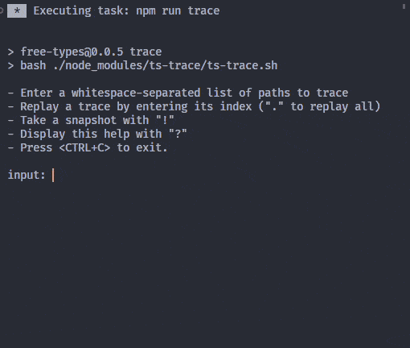

# ts-trace

An interactive Bash script to help [audit the performance](https://github.com/microsoft/TypeScript/wiki/Performance-Tracing) of your Typescript types.

<table>
<td valign="top" width="330">

### Features
- Trace a specific path or list of paths;
- Replay a specific trace;
- Create snapshots;
- Batch process multiple traces.

### What it does
1) Extend a base `tsconfig.json` and override the `include` field with the list of paths you supply;

1) Run `tsc --generateTrace` with that new config as the `--project`;

3) Record your input in a persistent log sorted by recency.
</td><td>


</table>

## Motivation

`tsc --generateTrace` is slow and the output is not very easy to interpret.

If you want to find your cubs and iterate quickly, you need to trace specific parts of your project.

Manually editing a `tsconfig.json` each time you want to trace something (or creating as many as you need) and comparing traces is a chore and is a bit messy.


## How to use

If you are on Windows I imagine you have [Git Bash](https://github.com/git-for-windows/git) installed (don't ask me why I did not do it in node...)

"install" it with npm (or simply drop `ts-trace.sh` somewhere in your project):

```
npm install github:geoffreytools/ts-trace
```

Add it to your npm-scripts in `package.json`:
```json
"scripts": {
    "trace": "bash ./node_modules/ts-trace/ts-trace.sh"
}
```

By default, the script is looking for a base `tsconfig.json` file in the root of your project where it also creates a `ts-trace` directory in which your `traces/` and the `log` will be located .

You can override the location of:
- the base tsconfig with the option `-i`
- the output folder with the option `-o`

For example
```json
"scripts": {
    "trace": "bash ./node_modules/ts-trace/ts-trace.sh -i ./src/tsconfig.json -o ./profiling"
}
```